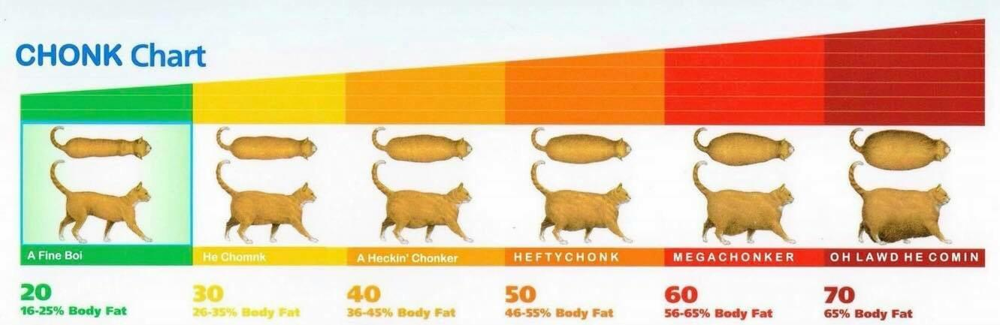

# ChonkOMeter
<!-- README START -->
Chonk O Meter is a state of the art size estimator. It will rate the size of anything according to the following chart:



    iex> ChonkOMeter.rate_my_animal(:cat, 10)
<!-- README END -->

## Installation

If [available in Hex](https://hex.pm/docs/publish), the package can be installed
by adding `chonk_o_meter` to your list of dependencies in `mix.exs`:

```elixir
def deps do
  [
    {:chonk_o_meter, "~> 0.1.0"}
  ]
end
```

Documentation can be generated with [ExDoc](https://github.com/elixir-lang/ex_doc)
and published on [HexDocs](https://hexdocs.pm). Once published, the docs can
be found at [https://hexdocs.pm/chonk_o_meter](https://hexdocs.pm/chonk_o_meter).

